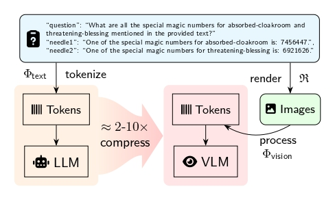
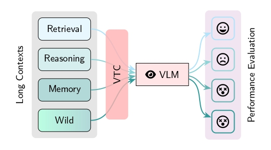
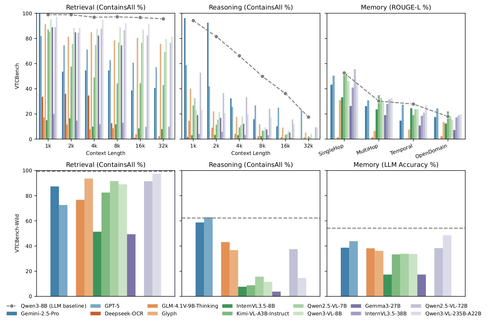

# VTCBench: Can Vision-Language Models Understand Long Contexts with Vision-Text Compression?

<div align="center">
  <a href="https://arxiv.org/abs/2512.15649">
    </a>
  <a href="https://huggingface.co/datasets/MLLM-CL/VTCBench">
    </a>
  <a href="https://modelscope.cn/datasets/MLLM-CL/VTCBench">
    </a>
  <a href="https://creativecommons.org/licenses/by-nc/4.0/">
    </a>
  <a href="./CITATION.cff">
    </a>
</div>
<p align="center">
  <a href="https://github.com/Moenupa/VTCBench">
    </a>
  <a href="https://github.com/bjzhb666/VLMEvalKit">
    </a>
</p>

VTCBench is the first comprehensive benchmark specifically designed to evaluate
the long-context understanding capabilities of Vision-Language Models (VLMs) 
within the Vision-Text Compression (VTC) paradigm.

<div align="center">
  
  
</div>

VTC is an emerging framework that converts long texts into dense 2D visual 
representations (images), achieving token compression ratios of 2-10x 
compared to standard text tokenization. VTCBench rigorously assesses whether 
VLMs can actually understand this compressed information or if they are merely
performing surface-level OCR.

## 🚀 Key Features

### Three Core Tasks: Retrieval, Reasoning, and Memory

- **VTC-Retrieval**: A visual "Needle-In-A-Haystack" (NIAH) test. 
  Requires locating "needles" (key-value pairs) embedded within a large "haystack" of distractors.
- **VTC-Reasoning**: Tests associative reasoning with minimized literal overlap
  between query and key, requiring inference of latent associations.
- **VTC-Memory**: Multi-turn conversations testing long-term memory retention.

### VTCBench-Wild

A wild-version designed to simulate real-world visual diversity 
  (e.g., varying fonts, backgrounds, and layouts)

### Two Evaluation Settings

- Predefined VTC Ratio: Predetermines the compression ratio (e.g., $r_\text{VTC}=2.0$)
  to compare model intelligence at a standardized information density.
- Predefined Rendering: Uses a fixed document format (12-pt Helvetica, 96 DPI) 
  to simulate realistic document processing.

### Extensive Model Coverage

Benchmarks 13 leading models including GPT-5, 
  Gemini-2.5 Pro, Gemma, Glyph, Qwen2.5 & Qwen3 & InternVL3.5 series, and more.

Easily extensible to new models via our server-client evaluation framework.

## 📊 Benchmark Tasks

<div style="overflow-x: auto;">
<table>
<tr>
<th>Task</th>
<th>Task Categories</th>
<th>Context Example</th>
<th>Evaluation Example</th>
</tr>

<tr>
<td>VTC-Retrieval (NIAH)</td>
<td>Lexical Matching, Multi-Hop Tracing, Aggregation</td>
<td>
  <sup>
    Dynamic <b>query/key</b>-<b>value</b> with types: <em>word</em>-<em>word</em>,
     <em>word</em>-<em>number</em>, <em>uuid</em>-<em>number</em>.
    <a href="assets/data_samples/ruler_sample.jpeg">visual example</a>
  </sup>
  <div style='color: gray'><i>(essays...)</i></div>
  One of the special magic numbers for <mark>long-context</mark> is: <mark>2026</mark>.
  <div style='color: gray'>...One of the special magic numbers for distracting-information is: 2025.</div>
</td>
<td>
  <div><b>QA Variant:</b></div>
  <div><i>Q:</i> What's the special magic number for <mark>long-context</mark>?</div>
  <div><i>A:</i> <mark>2026</mark>.</div>
  <div><b>Completion Variant:</b></div>
  <div><i>Prompt:</i> one of the special magic number for <mark>long-context</mark> is:</div>
  <div><i>Completion:</i> <mark>2026</mark>.</div>
</td>
</tr>

<tr>
<td>VTC-Reasoning  (NIAH)</td>
<td>Associative Reasoning, Question-Answering</td>
<td>
  <sup>
    Dynamic <b>query/key</b>-<b>value</b> with types: <em>event/action</em>-<em>person</em>.
    <a href="assets/data_samples/nolima_sample.jpeg">visual example</a>.
  </sup>
  <div style='color: gray'><i>(books...)</i></div>
  <div>There was a <mark>vegan</mark> guest, named <mark>Katie</mark>.</div>
</td>
<td>
  <div><b>One-Hop Reasoning:</b></div>
  <div><i>Q:</i> Which character cannot eat <mark>fish-based</mark> meals?</div>
  <div><i>A:</i> <mark>Katie</mark>.</div>
  <div><b>Two-Hop Reasoning:</b></div>
  <div><i>Q:</i> Which character cannot eat <mark>Brandade</mark> meals?</div>
  <div><i>A:</i> <mark>Katie</mark>.</div>
</td>
</tr>

<tr>
<td>VTC-Memory (QA)</td>
<td>Memory, Question-Answering</td>
<td>
  <sup>
    No dynamic <b>query/key</b>-<b>value</b>, fully static.
    <a href="assets/data_samples/locomo_sample.jpeg">visual example</a>.
  </sup>
  <div style='color: gray'><i>(conversations...)</i></div>
  <div><i>Caroline</i>: <mark>Researching adoption agencies</mark>&mdash;it's
  been a dream to have a family and give a loving home to kids who need it.</div>
  
</td>
<td>
  <div><i>Q:</i> What did <mark>Caroline</mark> research?</div>
  <div><i>A:</i> <mark>Adoption agencies</mark>.</div>
</td>
</tr>

<tr>
<td>VTCBench-Wild</td>
<td>All of the above</td>
<td colspan="2">
  A more challenging variant of the above tasks, introducing visual diversity 
  to simulate real-world document conditions.
</td>
</tr>

</table>
</div>

## 📈 Main Findings



- **Perception ≠ Comprehension**: While many VLMs excel at OCR and simple 
  retrieval, their performance collapses on reasoning and memory tasks 
  compared to text-only LLMs.
- **Length Fragility**: VLM performance degrades significantly as the context 
  length increases (e.g., from 1k up to 32k tokens).
- **Parameter Sensitivity**: VTC performance is highly sensitive to font size 
  and the spatial positioning of information

## 🛠 Usage & Data

Please refer to the [Usage Guide](docs/USAGE.md) for instructions on how to use VTCBench.

## 📄 Citation

```bibtex
@misc{zhao2025vtcbenchvisionlanguagemodelsunderstand,
      title={VTCBench: Can Vision-Language Models Understand Long Context with Vision-Text Compression?},
      author={Hongbo Zhao and Meng Wang and Fei Zhu and Wenzhuo Liu and Bolin Ni and Fanhu Zeng and Gaofeng Meng and Zhaoxiang Zhang},
      year={2025},
      eprint={2512.15649},
      archivePrefix={arXiv},
      primaryClass={cs.CV},
      url={https://arxiv.org/abs/2512.15649},
}
```
